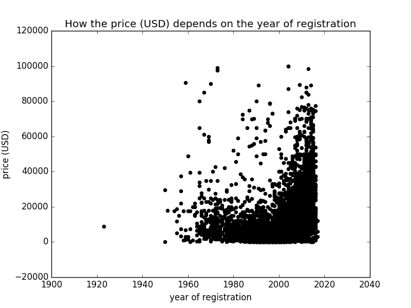

# SCIKIT-LEARN: LINEAR REGRESSION

## Description

Over 370000 used cars are in dataset (autos.csv, crawled data). It contains the next fields:

* dateCrawled: when this ad was first crawled, all field-values are taken from this date
* name : "name" of the car
* seller : private or dealer
* offerType
* price : the price on the ad to sell the car
* abtest
* vehicleType
* yearOfRegistration : at which year the car was first registered
* gearbox
* powerPS : power of the car in PS
* model
* kilometer : how many kilometers the car has driven
* monthOfRegistration : at which month the car was first registered
* fuelType
* brand
* notRepairedDamage : if the car has a damage which is not repaired yet
* dateCreated : the date for which the ad at ebay was created
* nrOfPictures : number of pictures in the ad
* postalCode
* lastSeenOnline : when the crawler saw this ad last online

The aim is to predict sale price of the car using scikit-learn.

Ridge was chosen for it.

Given script includes the following steps:

* data preprocessing

* linear model training

* predicting of sale prices

* showing results (matplotlib)

**Installation**

```
git clone https://github.com/YevheniiaSmyrnova/cars_sale_price_prediction.git
cd cars_sale_price_prediction
docker-compose up
```

# Results

Sale price of the car is predicted with accuracy 68%




